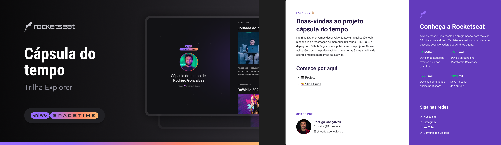

  

## 💻 Projeto

Essa é uma adaptação do projeto Web Resposivo de uma cápsula do tempo feita durante o NLW da Rocketseat. No qual criei uma linha do tempo com meus canais favoritos do YouTube.
## [Visualize a Página do Projeto Aqui](https://dairussi.github.io/nlw-spacetime/)

## 🚀 Tecnologias

Esse projeto foi desenvolvido com as seguintes tecnologias:

- HTML
- CSS
- Git e github

## 🏷️ Layout

Vocẽ pode visualizar o Layout do projeto através [desse link](<https://www.figma.com/file/CHV2ySXakEYADbRReE5muw/C%C3%A1psula-do-tempo-%E2%80%A2-Trilha-Explorer-(Community)?type=design&node-id=306-3&t=Ox0mPc51A3cxh9lc-0>).
É necessário ter uma conta no Figma [Figma](https://www.figma.com/).
